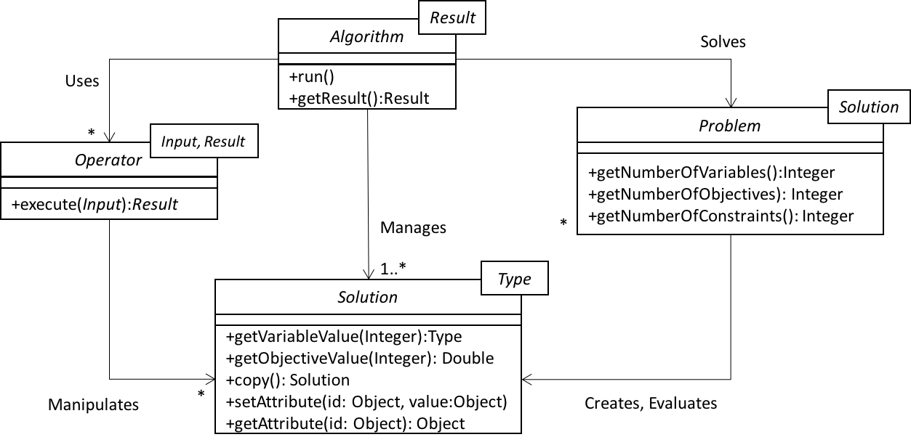

# jMetalPy: Python version of the jMetal framework

I started a new project called jMetalPy in February 2017. The initial idea was not to write the whole jMetal proyect in Python but to use it as a practical study to learn that programming language, although due to the interest of some researchers the goal of an usable jMetal version in Python is an ongoing work.

Any ideas about how the structure the project, coding style, useful tools (I'm using PyCharm), or links to related projects are welcome. The starting point is the jMetal architecture:

---

# Last changes (July 10th 2017)
* The [ZDT](https://github.com/jMetal/jMetalPy/blob/master/jmetal/problem/multiobjective/zdt.py) problems have been implemented.

# Last changes (July 4th 2017)
* The algorithm [NSGA-II](https://github.com/jMetal/jMetalPy/blob/master/jmetal/algorithm/multiobjective/nsgaii.py) has been implemented
* Examples of configuring and running all the included algorithms are located in the [jmetal.runner](https://github.com/jMetal/jMetalPy/tree/master/jmetal/runner) package.

# Last changes (June 1st 2017)
* The package organization has been simplified to make it more "Python-ish". The former oarganization was a clone of the original Java-based jMetal project.
* The [`EvolutionaryAlgorithm`](https://github.com/jMetal/jMetalPy/blob/master/jmetal/core/algorithm.py) class interits from `threading.Thread`, so any evolutionary algorithm can run as a thread. This class also contains an `Observable` field, allowing observer entities to register to be notified with algorithm information. 
* [Four examples](https://github.com/jMetal/jMetalPy/tree/master/jmetal/runner) of configuring and running three different single-objective algorithms are provided.

# Current status (July 10th 2017)
The current implementation contains the following features: 
* Algorithms
  * Multi-objective
    * NSGA-II
  * Single-objective
    * (mu+lamba)Evolution Strategy
    * (mu,lamba)Evolution Strategy
    * Generational Genetic algorithm
* Problems (multi-objective)
  * Kursawe
  * Fonseca
  * Schaffer
  * Viennet2
  * ZDT1, ZDT2, ZDT3, ZDT4, ZDT6
* Problems (single-objective)
  * Sphere
  * OneMax
* Encoding
  * Float
  * Binary
* Operators
  * SBX Crossover
  * Single Point Crossover
  * Polynomial Mutation
  * Bit Flip Mutation
  * Simple Random Mutation
  * Null Mutation
  * Uniform Mutation
  * Binary Tournament Selection

# TODO list
* The documentation of the code is not complete
* Inclusion of integration tests for the algorithm implementations
* Full coverage with unit tests

# Contributing
  Contributions to the jMetalPy project are welcome. Please, take into account the following guidelines if possible:

  - [Git WorkFlow](resources/pages/workflow_git.md)
  - [Follow style guide for python code: PEP8](resources/pages/code_style.md)
  - [Object-oriented programming](resources/pages/poo.md)
  - [Incorporate the new features of Python 3.5](resources/pages/features_python3.md)
  - [Respect the initial structure](resources/pages/project_structure.md)
  - [How to create auto documentation using compatible code](resources/pages/auto_doc.md)
