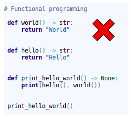
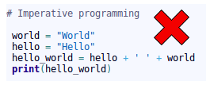
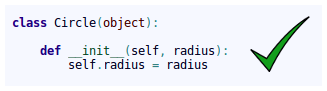
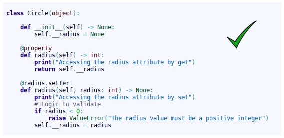
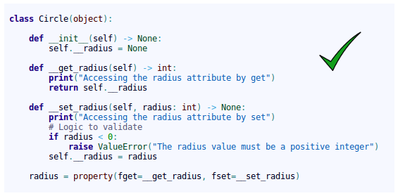
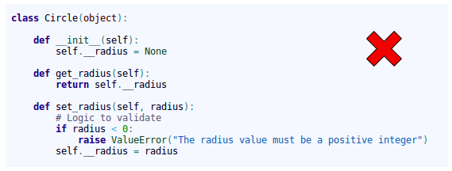
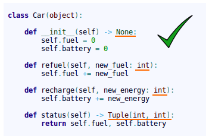
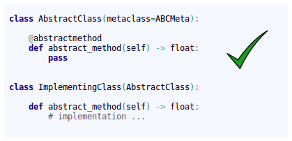

# jMetalPy: Python version of the jMetal framework

I have just started a new project called jMetalPy. The initial idea is not to write the whole jMetal proyect in Python, but to "have fun": I'm starting with Python, and to learn this programming language I think that using jMetal as a case study would be nice.

Any ideas about how the structure the project, coding style, useful tools (I'm using PyCharm), or links to related projects are welcome. The starting point is the jMetal architecture:

---

## Developers

All developers should follow these guidelines:

  - Follow style guide for python code: [PEP8](https://www.python.org/dev/peps/pep-0008)
  - Object-oriented programming
  - Incorporate the new features of Python 3.5
  - Respect the initial structure

### PEP8!

It is really important to follow some standards when a team develops an application. If all team members format the code in the same format, then it is much easier to read the code. PEP8 is Python's style guide. It's a set of rules for how to format your Python code.

Some style rules:

  - Package and module names:  
Modules should have short, **all-lowercase** names. Underscores can be used in the module name if it improves readability. Python packages should also have short, **all-lowercase** names, although the use of underscores is discouraged. In Python, a module is a file with the suffix '.py'.

  - Class names:  
Class names should normally use the **CapWords** convention. 

  - Method names and instance variables:  
**Lowercase with words separated by underscores** as necessary to improve readability. 

There are many more style standards in PEP8! &nbsp; &rarr; [PEP8 documentation](https://www.python.org/dev/peps/pep-0008).  
The most appropriate is to use an IDE that has support for PEP8. For example, [PyCharm](https://www.jetbrains.com/pycharm/).

### Object-oriented programming!

**Object-oriented programming should be the single programming paradigm used**. Avoiding as far as possible, imperative and functional programming.

In classes, we directly access the attributes, which are usually defined as public.

Only when we want to **implement additional logic in the accesses to the attributes** we define getter/setter methods, but **always by using the ***property*** annotation or the ***property*** function**:

By using ***property***, we continue to access the attributes directly:

Do not use getter/setter methods without the *property* annotation or the *property* function:

Since this way of accessing the attribute is not commonly used in Python:

### Python 3.5!

We use the new features of python 3. Concretely, up to version **3.5**.

#### Typing

We **always** define types in the parameters of the arguments and the return value:

#### Abstract class

We can define abstract classes (ABCs) in Python:

In the case that we want to define an **interface** class, it is done in the same way. We just have to define all the methods of the class as abstract.

#### Generic classes and types

Example of use of generic types:

In the code below, the IDE displays a **warning**, since although the 2nd parameter is a float type, which is a type allowed in the definition of the generic type X, it is not of the same type as the first, since the first 2 parameters must be of the same generic type (S):

In the code below, the IDE displays a **warning**, since the 2nd parameter is a type not allowed in the definition of the generic type ( *TypeVar('S', int, float)* ):

Example of use of **generic class**. When the class inherits from *Generic[...]*, the class is defined as generic. In this way we can indicate the types that will have the values of the generic types, when using the class as type. Look at the *add_car()* method of the *Parking* class.

NOTE: The generic classes inherit from abc.ABCMeta, so they are abstract classes and **abstract methods can be used** .

In the code below, the IDE displays a warning in the call to the *add_car()* method when adding the car, since the 3rd parameter of the init must be a *str* type, as defined in the *add_car()* method of the *Parking* class.

When inheriting from generic classes, some type variables could be fixed:

Inheritance from non-generic class to generic class:

Inheritance from generic class to another generic class:

### Structure!

Python is not Java. In Java, you cannot, by design, have more than one class in a file. In Python, you can do it.

In Python, **it is appropriate to group several classes into a single .py file. For that reason, the .py files are called modules.**

> **Note:** <i>Pending definition.</i>

