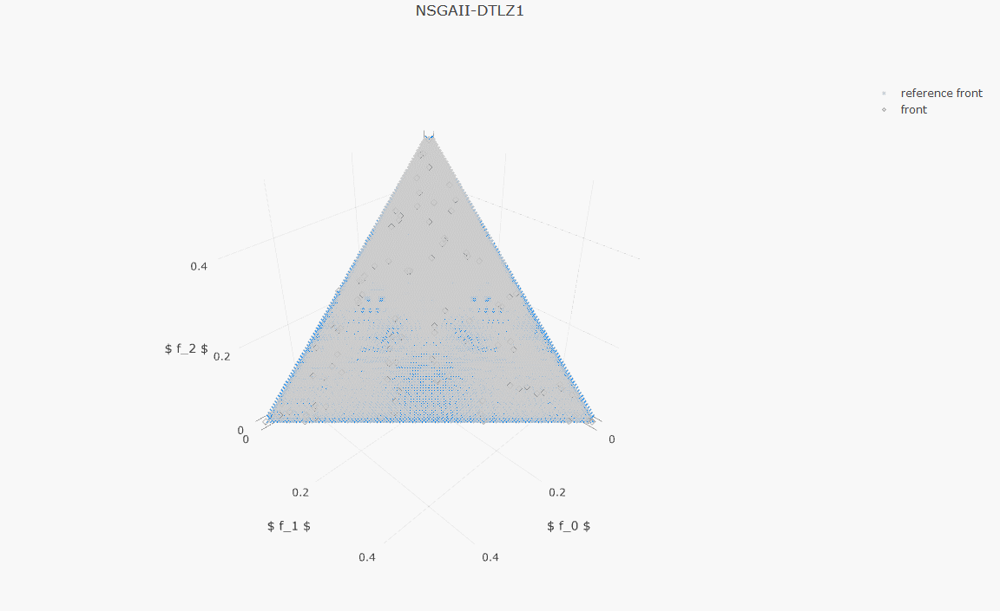
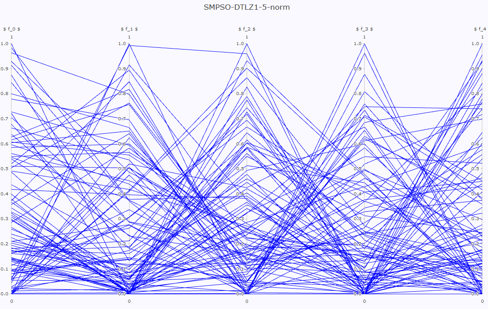
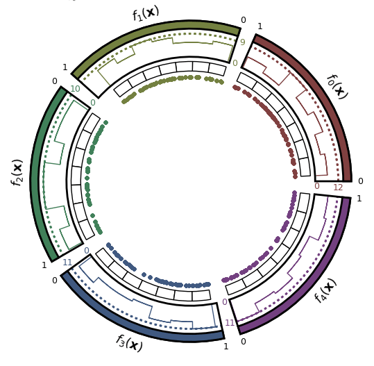

[](https://github.com/jMetal/jMetalPy/actions/workflows/lint.yml)
[](https://github.com/jMetal/jMetalPy/actions/workflows/test.yml)
[](https://github.com/jMetal/jMetalPy/actions/workflows/build.yml)
[](https://github.com/jMetal/jMetalPy/actions/workflows/docs.yml)
[](https://www.python.org/downloads/)
[](https://pypi.org/project/jMetalPy/)
[](https://doi.org/10.1016/j.swevo.2019.100598)
[](https://pypi.org/project/jMetalPy/)

A paper introducing jMetalPy is available at: https://doi.org/10.1016/j.swevo.2019.100598

### Table of Contents
- [Installation](#installation)
- [Usage](#hello-world-)

- [Agents](#agents)
- [Features](#features)
- [Changelog](#changelog)
- [License](#license)

## Installation

You can install the latest version of jMetalPy with `pip`, 

```console
pip install jmetalpy  # or "jmetalpy[distributed]"
```

<details><summary><b>Notes on installing with <tt>pip</tt></b></summary>
<p>

jMetalPy includes features for parallel and distributed computing based on [pySpark](https://spark.apache.org/docs/latest/api/python/index.html) and [Dask](https://dask.org/).

These (extra) dependencies are *not* automatically installed when running `pip`, which only comprises the core functionality of the framework (enough for most users):

```console
pip install jmetalpy
```

This is the equivalent of running: 

```console
pip install "jmetalpy[core]"
```

Other supported commands are listed next:

```console
pip install "jmetalpy[dev]"  # Install requirements for development
pip install "jmetalpy[distributed]"  # Install requirements for parallel/distributed computing
pip install "jmetalpy[complete]"  # Install all requirements
```

</p>
</details>

## Hello, world! 👋

Examples of configuring and running all the included algorithms are located [in the documentation](https://jmetal.github.io/jMetalPy).

```python
from jmetal.algorithm.multiobjective import NSGAII
from jmetal.operator.crossover import SBXCrossover
from jmetal.operator.mutation import PolynomialMutation
from jmetal.problem import ZDT1
from jmetal.util.termination_criterion import StoppingByEvaluations

problem = ZDT1()

algorithm = NSGAII(
    problem=problem,
    population_size=100,
    offspring_population_size=100,
    mutation=PolynomialMutation(probability=1.0 / problem.number_of_variables(), distribution_index=20),
    crossover=SBXCrossover(probability=1.0, distribution_index=20),
    termination_criterion=StoppingByEvaluations(max_evaluations=25000)
)

algorithm.run()
```

We can then proceed to explore the results:

```python
from jmetal.util.solution import get_non_dominated_solutions, print_function_values_to_file, print_variables_to_file

front = get_non_dominated_solutions(algorithm.result())

# save to files
print_function_values_to_file(front, 'FUN.NSGAII.ZDT1')
print_variables_to_file(front, 'VAR.NSGAII.ZDT1')
```

Or visualize the Pareto front approximation produced by the algorithm:

```python
from jmetal.lab.visualization import Plot

plot_front = Plot(title='Pareto front approximation', axis_labels=['x', 'y'])
plot_front.plot(front, label='NSGAII-ZDT1', filename='NSGAII-ZDT1', format='png')
```


## Agents

If you use AI assistants (e.g., Copilot, Codex) while working on this project, please follow the guidelines in [AGENTS.md](AGENTS.md).


## Features
The current release of jMetalPy (v1.9.0) contains the following components:

* Algorithms: local search, genetic algorithm, evolution strategy, simulated annealing, random search, NSGA-II, NSGA-III, SMPSO, OMOPSO, MOEA/D, SMS-EMOA, MOEA/D-DRA, MOEA/D-IEpsilon, GDE3, SPEA2, HYPE, IBEA, MOCell. Preference articulation-based algorithms (G-NSGA-II, G-GDE3, G-SPEA2, SMPSO/RP); Dynamic versions of NSGA-II, SMPSO, and GDE3.
* Parallel computing based on Apache Spark and Dask.
* Benchmark problems: ZDT1-6, DTLZ1-7, WFG1-9, ZCAT1-20, eqDTLZ, FDA, LZ09, UF (CEC'09), LIR-CMOP, RWA, RE, a multi-objective TSP, unconstrained (Kursawe, Fonseca, Schaffer, Viennet2, and the CONV/DENT/SYM-PART/SSW/TWO-ON-ONE/OMNI-TEST family in misc.py), constrained (Srinivas, Tanaka, Osyczka2, Binh2).
* Encodings: real, integer, binary, permutations.
* Operators: selection (binary tournament, ranking and crowding distance, random, nary random, best solution), crossover (single-point, SBX, PMX, CX, BLX-Alpha, BLX-Alpha-Beta, arithmetic, UNDX, differential evolution), mutation (bit-flip, polynomial, uniform, random, non-uniform, Levy flight, power-law).
* Quality indicators: hypervolume, normalized hypervolume, additive epsilon, GD, IGD, IGD+, average Hausdorff distance.
* Pareto front approximation plotting in real-time, static or interactive.
* Experiment class for performing studies either alone or alongside [jMetal](https://github.com/jMetal/jMetal).
* Pairwise and multiple hypothesis testing for statistical analysis, including several frequentist and Bayesian testing methods, critical distance plots and posterior diagrams.

|  |  |
|-------------- | ----------------  |
|  |  |

## Changelog

See [CHANGELOG.md](CHANGELOG.md).

## License

This project is licensed under the terms of the MIT - see the [LICENSE](LICENSE) file for details.
