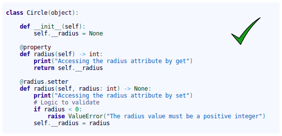
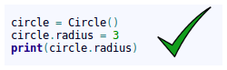
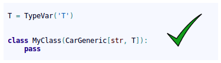
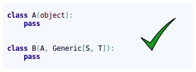

Contributing
================================================

Contributions to the jMetalPy project are welcome.
Please, take into account the following guidelines (all developers should follow these guidelines):

Git WorkFlow
-------------------------------

We have a set of branches on the remote Git server.
Some branches are temporary, and others are constant throughout the life of the repository.

* Branches always present in the repository:
    * *master*: You have the latest released to production, receive merges from the develop branch, or merge from a *hotfix* branch (emergency).
        * Do I have to put a TAG when doing a merge from develop to master? yes
        * Do I have to put a TAG when doing a merge from a hotfix branch to master? yes
        * After merge from a hotfix to master, do I have to merge from master to develop? yes
    * *develop*: It is considered the "Next Release", receives merges from branches of each developer, either corrections (*fix*) or new features (*feature*).

* Temporary branches:
    * *feature/\<task\-id\>\-\<description\>*: When we are doing a development, we create a local branch with the prefix "feature/", then only if there is a task id, we indicate it and we add a hyphen. The following we indicate a description according to the functionality that we are developing. The words are separated by hyphens.
        * Where does this branch emerge? This branch always emerge from the develop branch
        * When I finish the development in my feature branch, which branch to merge into?: You always merge feature branch into develop branch

    * *fix/\<task\-id\>\-\<description\>*: When we are making a correction, we create a local branch with the prefix "fix/", then only if there is a task id, we indicate it and we add a hyphen. The following we indicate a description according to the functionality that we are correcting. The words are separated by hyphens.
        * Where does this branch emerge? This branch always emerge from the develop branch
        * When I finish the correction in my fix branch, which branch to merge into?: You always merge feature branch into develop branch

    * *hotfix/\<task\-id\>\-\<description\>*: When we are correcting an emergency incidence in production, we create a local branch with the prefix "hotfix/", then only if there is a task id, we indicate it and we add a hyphen. The following we indicate a description according to the functionality that we are correcting. The words are separated by hyphens.
        * Where does this branch emerge?: This branch always emerge from the master branch
        * When I finish the correction in my hotfix branch, which branch to merge into?: This branch always emerge from the master and develop branch

* Steps to follow when you are creating or going to work on a branch of any kind (feature / fix / hotfix):
    1. After you create your branch (feature / fix / hotfix) locally, upload it to the remote Git server. The integration system will verify your code from the outset.
    2. Each time you commit, as much as possible, you send a push to the server. Each push will trigger the automated launch of the tests, etc.
    3. Once the development is finished, having done a push to the remote Git server, and that the test phase has passed without problem, you create an `pull request <https://help.github.com/articles/creating-a-pull-request/>`_.

.. note::  Do not forget to remove your branch (feature / fix / hotfix) once the merge has been made.

Some useful Git commands:

* git fetch --prune: Cleaning branches removed and bringing new branches

PEP8!
-------------------------------

It is really important to follow some standards when a team develops an application. If all team members format the code in the same format, then it is much easier to read the code. PEP8 is Python's style guide. It's a set of rules for how to format your Python code.

Some style rules:

* Package and module names: Modules should have short, **all-lowercase** names. Underscores can be used in the module name if it improves readability. Python packages should also have short, **all-lowercase** names, although the use of underscores is discouraged. In Python, a module is a file with the suffix '.py'.
* Class names: Class names should normally use the **CapWords** convention.
* Method names and instance variables: **Lowercase with words separated by underscores** as necessary to improve readability.

There are many more style standards in PEP8 so, please, refer to `PEP8 documentation <https://www.python.org/dev/peps/pep-0008>`_
. The most appropriate is to use an IDE that has support for PEP8. For example, `PyCharm <https://www.jetbrains.com/pycharm/>`_.

Object-oriented programming
-------------------------------

**Object-oriented programming should be the single programming paradigm used**. Avoiding as far as possible, imperative and functional programming.

.. image:: contributing/python_poo_programming.png

.. image:: contributing/python_functional_programming.png

.. image:: contributing/python_imperative_programming.png

In classes, we directly access the attributes, which are usually defined as public.

.. image:: contributing/without_getter_setter.png

Only when we want to **implement additional logic in the accesses to the attributes** we define getter/setter methods, but **always by using the *property*** annotation or the ***property*** function:

.. image:: contributing/property_functional.png

By using ***property***, we continue to access the attributes directly:

Do not use getter/setter methods without the *property* annotation or the *property* function:

.. image:: contributing/with_getter_setter.png

Since this way of accessing the attribute is not commonly used in Python:

.. image:: contributing/bad_access.png

Structure
-------------------------------

Python is not Java. In Java you cannot, by design, have more than one class in a file. In Python, you can do it.

In Python, **it is appropriate to group several classes into a single .py file. For that reason, the .py files are called modules.**

Python 3.6
-------------------------------

We **always** define types in the parameters of the arguments and the return value:

.. image:: contributing/types_in_methods.png

We can define abstract classes (ABCs) in Python:

.. image:: contributing/abstract.png

In the case that we want to define an **interface** class, it is done in the same way. We just have to define all the methods of the class as abstract.

Example of use of generic types:

.. image:: contributing/generic_types.png

In the code below, the IDE displays a **warning**, since although the 2nd parameter is a float type, which is a type allowed in the definition of the generic type X, it is not of the same type as the first, since the first 2 parameters must be of the same generic type (S):

.. image:: contributing/instance_with_generic_types1_wearning.png

In the code below, the IDE displays a **warning**, since the 2nd parameter is a type not allowed in the definition of the generic type ( *TypeVar('S', int, float)* ):

.. image:: contributing/instance_with_generic_types2_wearning.png

When the class inherits from *Generic[...]*, the **class is defined as generic**. In this way we can indicate the types that will have the values of the generic types, when using the class as type. Look at the *add_car()* method of the *Parking* class.

.. note:: The generic classes inherit from abc.ABCMeta, so they are abstract classes and **abstract methods can be used**.

.. image:: contributing/generic_class1.png

.. image:: contributing/generic_class2.png

In the code below, the IDE displays a **warning** in the call to the *add_car()* method when adding the car, since the 3rd parameter of the init must be a *str* type, as defined in the *add_car()* method of the *Parking* class.

.. image:: contributing/instance_with_generic_class_wearning.png

When inheriting from generic classes, some type variables could be fixed:

Example of inheritance from non-generic class to generic class:

Example of inheritance from generic class to another generic class:

.. image:: contributing/inheritance_generic_to_generic.png

Create automatic documentation files with Sphinx
--------------------------------------------------

First, you need to know how to correctly document your code. It is **important** to follow these simple rules in order to automatically create good documentation for the project.

When you create a new module file (testDoc.py in this example), you should mention it using this format:

.. code-block:: python

  """
  .. module:: testDoc
     :platform: Unix, Windows
     :synopsis: A useful module indeed.

  .. moduleauthor:: Andrew Carter <andrew@invalid.com>
  """

  class testDoc(object):
      """We use this as a public class example class.

      This class is ruled by the very trendy important method :func:`public_fn_with_sphinxy_docstring`.

      .. note::
         An example of intersphinx is this: you **cannot** use :mod:`pickle` on this class.
      """

      def __init__(self):
          pass

This code snippet generates the following documentation:

.. image:: contributing/class_header.png

Now, you can document your methods using the following sintax:

.. code-block:: python

   def public_fn_with_sphinxy_docstring(self, name: str, state: bool = False) -> int:
       """This function does something.

       :param name: The name to use.
       :type name: str.
       :param state: Current state to be in.
       :type state: bool.
       :returns:  int -- the return code.
       :raises: AttributeError, KeyError
       """
       return 0

   def public_fn_without_docstring(self):
       return True

And the produced output doc will be:

.. image:: contributing/method_way_sphinx.png

As you may notice, if you don't use any docstring, the method documentation will be empty.