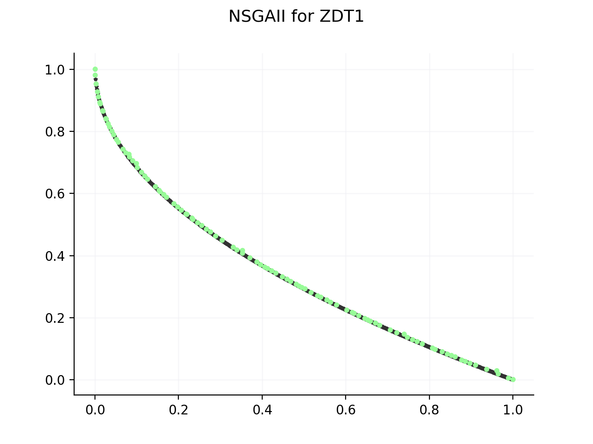

.. jMetalPy documentation master file, created by
   sphinx-quickstart on Fri May  4 10:10:17 2018.
   You can adapt this file completely to your liking, but it should at least
   contain the root `toctree` directive.

jMetalPy: Python version of the jMetal framework
================================================

.. warning:: Documentation is WIP!! Some information may be missing.

.. toctree::
   :maxdepth: 1
   :caption: Contents:

   examples
   contributing
   about
   api/jmetal

Installation steps
------------------------

Via pip:

.. code-block:: console

    $ pip install jmetalpy

Via Github:

.. code-block:: console

    $ git clone https://github.com/jMetal/jMetalPy.git
    $ pip install -r requirements.txt
    $ python setup.py install

Basic usage
-----------

.. code-block:: python

    problem = ZDT1()

    algorithm = NSGAII(
        problem=problem,
        population_size=100,
        max_evaluations=25000,
        mutation=Polynomial(probability=1.0/problem.number_of_variables, distribution_index=20),
        crossover=SBX(probability=1.0, distribution_index=20),
        selection=BinaryTournamentSelection(comparator=RankingAndCrowdingDistanceComparator())
    )

    algorithm.run()
    front = algorithm.get_result()

    pareto_front = ScatterMatplotlib(plot_title='NSGAII for ZDT1', number_of_objectives=problem.number_of_objectives)
    pareto_front.plot(front, reference=problem.get_reference_front(), output='NSGAII-ZDT1', show=False)

