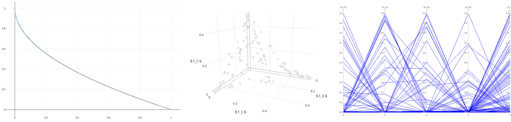

.. jMetalPy documentation master file, created by
   sphinx-quickstart on Fri May  4 10:10:17 2018.
   You can adapt this file completely to your liking, but it should at least
   contain the root `toctree` directive.

jMetalPy: Python version of the jMetal framework
================================================

.. warning:: Documentation is WIP!! Some information may be missing.

.. toctree::
   :maxdepth: 1
   :caption: Contents:

   examples
   contributing
   about
   api/jmetal

Installation steps
------------------------

Via pip:

.. code-block:: console

    $ pip install jmetalpy

Via Github:

.. code-block:: console

    $ git clone https://github.com/jMetal/jMetalPy.git
    $ pip install -r requirements.txt
    $ python setup.py install

Features
------------------------
The current release of jMetalPy (v0.9.0) contains the following components:

* Algorithms: local search, genetic algorithm, evolution strategy, simulated annealing, random search, NSGA-II, SMPSO, OMOPSO, MOEA/D, GDE3. Preference articulation-based algorithms; G-NSGA-II and SMPSO/RP; Dynamic versions of NSGA-II and SMPSO.
* Parallel computing based on Apache Spark and Dask.
* Benchmark problems: ZDT1-6, DTLZ1-2, FDA, LZ09, unconstrained (Kursawe, Fonseca, Schaffer, Viennet2), constrained (Srinivas, Tanaka).
* Encodings: real, binary, permutations.
* Operators: selection (binary tournament, ranking and crowding distance, random, nary random, best solution), crossover (single-point, SBX), mutation (bit-blip, polynomial, uniform, random).
* Quality indicators: hypervolume, additive epsilon, GD, IGD.
* Pareto front plotting for problems with two or more objectives (as scatter plot/parallel coordinates/chordplot) in real-time, static or interactive.
* Experiment class for performing studies either alone or alongside jMetal.
* Pairwise and multiple hypothesis testing for statistical analysis, including several frequentist and Bayesian testing methods, critical distance plots and posterior diagrams.

