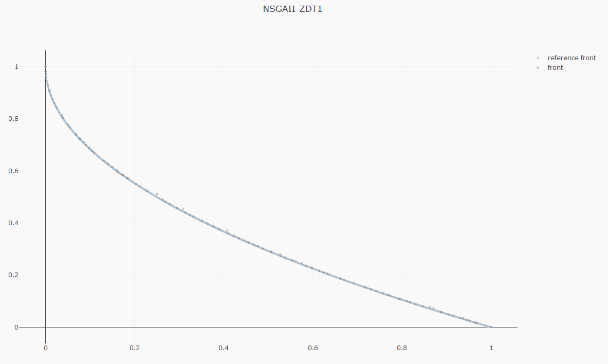

# Front visualization

The `jmetal.lab.visualization` submodule contains several classes useful for plotting solutions.
jMetalPy includes three types of visualization charts: static, interactive and streaming.

## Static plots

It is possible to visualize the final front approximation by using the `Plot` class:

```python
from jmetal.lab.visualization import Plot

plot_front = Plot(title='Pareto front approximation', axis_labels=['x', 'y'])
plot_front.plot(front, label='NSGAII-ZDT1')
```

!!! note
    Static charts can be shown on the screen or stored in a file by setting the filename.

For problems with two and three objectives, the figure produced is a scatter plot; for problems
with more than three objectives, a parallel coordinates plot is used. Note that any arbitrary
number of fronts can be plotted for comparison purposes:

```python
plot_front = Plot(title='Pareto front approximation', axis_labels=['x', 'y'])
plot_front.plot([front1, front2], label=['zdt1', 'zdt2'], filename='output', format='eps')
```

<div style="display:flex;gap:1em;flex-wrap:wrap">
  
  
  
</div>

### API

::: jmetal.lab.visualization.plotting

## Interactive plots

This kind of plot is interactive, in the sense that every solution can be manipulated (e.g.,
actions such as zoom, selecting part of the graph, or clicking on a point to see its objective
values are allowed).

```python
plot_front = InteractivePlot(title='Pareto front approximation')
plot_front.plot(front, label='NSGAII-ZDT1', filename='NSGAII-ZDT1-interactive')
```

### API

::: jmetal.lab.visualization.interactive

## Streaming plots

The visualizer observer displays the front in real-time (note **it only works for problems with
two and three objectives**) during the execution of multi-objective algorithms; this can be useful
to observe the evolution of the Pareto front approximation:

```python
from jmetal.util.observer import VisualizerObserver

algorithm.observable.register(observer=VisualizerObserver(reference_front=problem.reference_front))
```

### API

::: jmetal.lab.visualization.streaming
    options:
      filters: ["!^_", "!^S$", "!^pause$"]

## Chord plot


### API

::: jmetal.lab.visualization.chord_plot

## Posterior plot

### API

::: jmetal.lab.visualization.posterior
